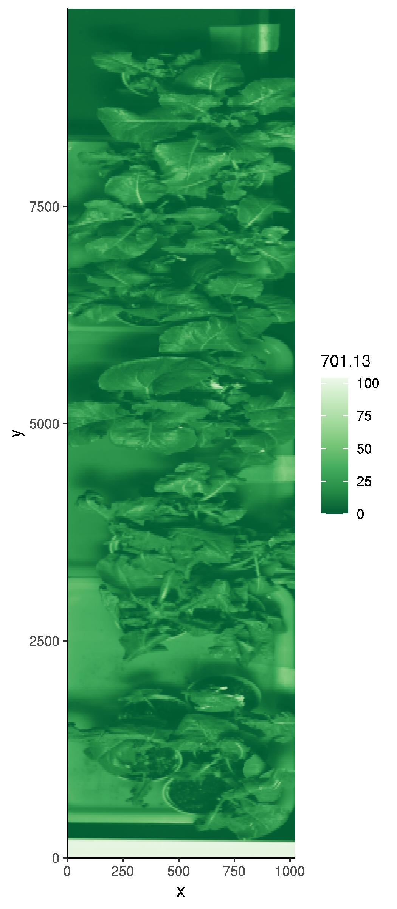
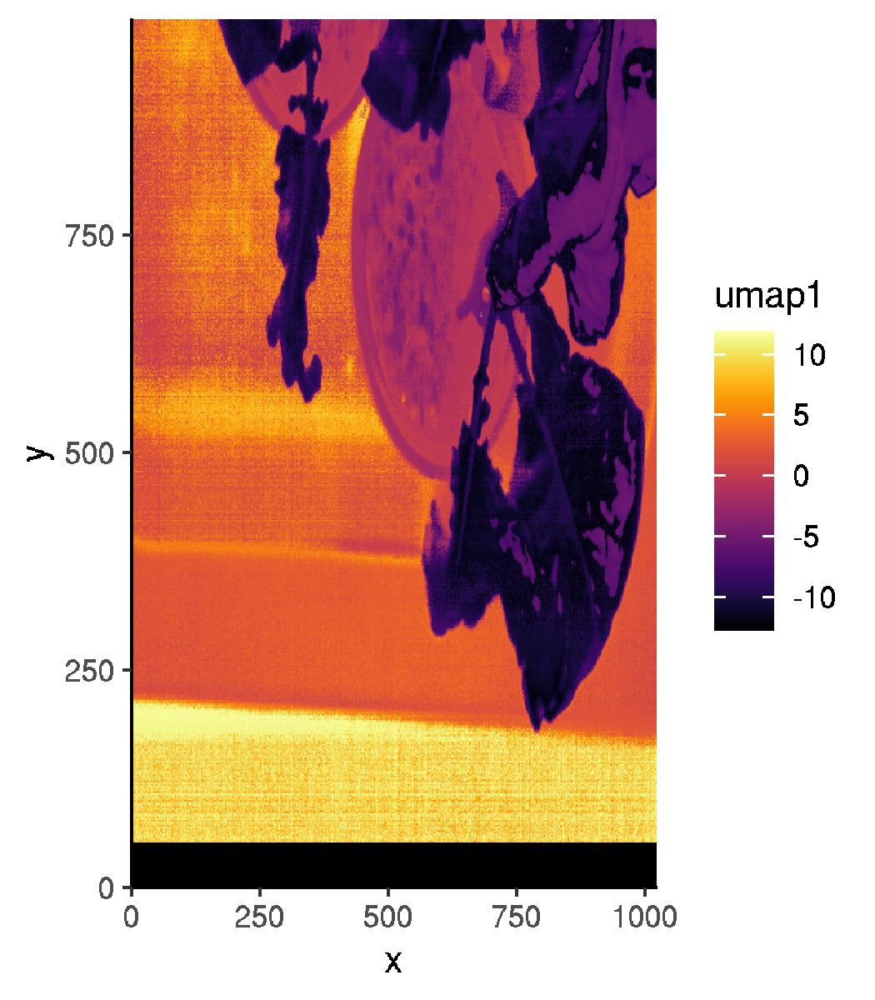
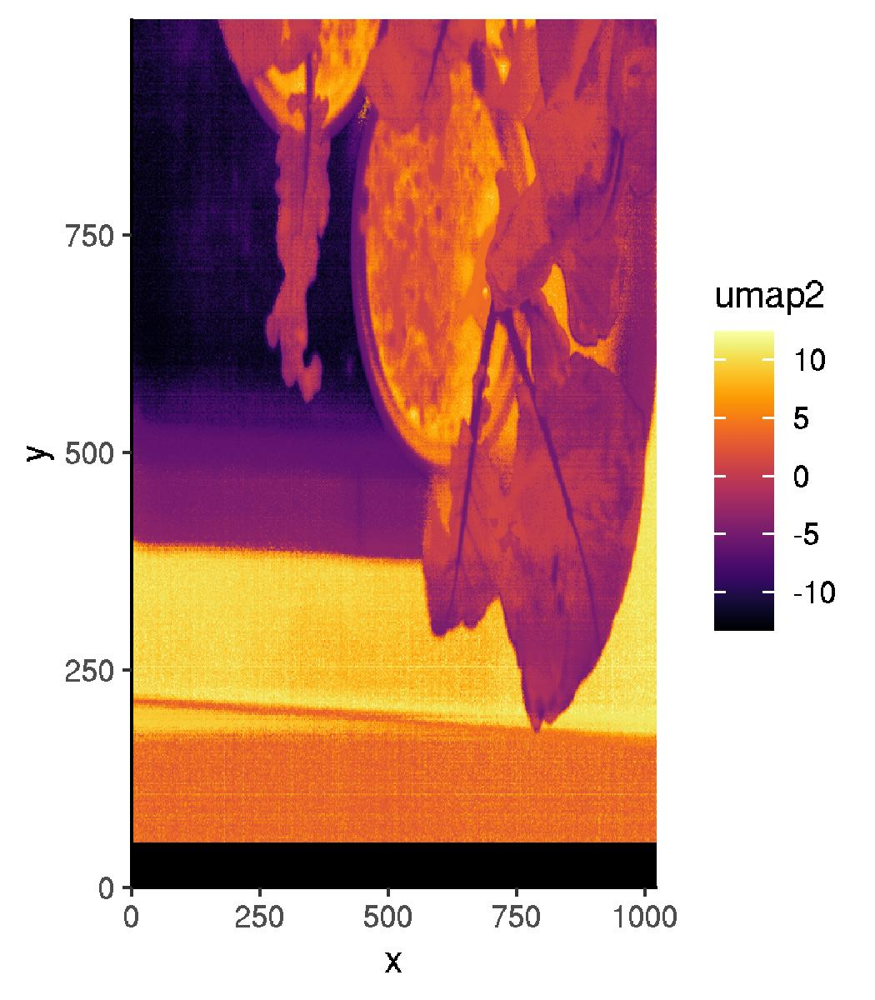
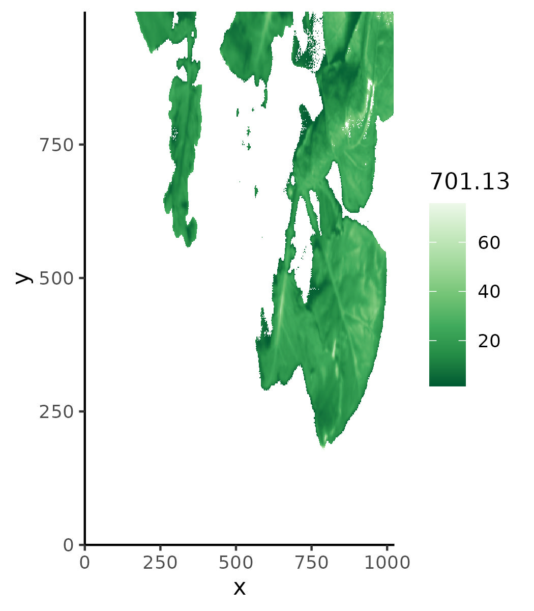
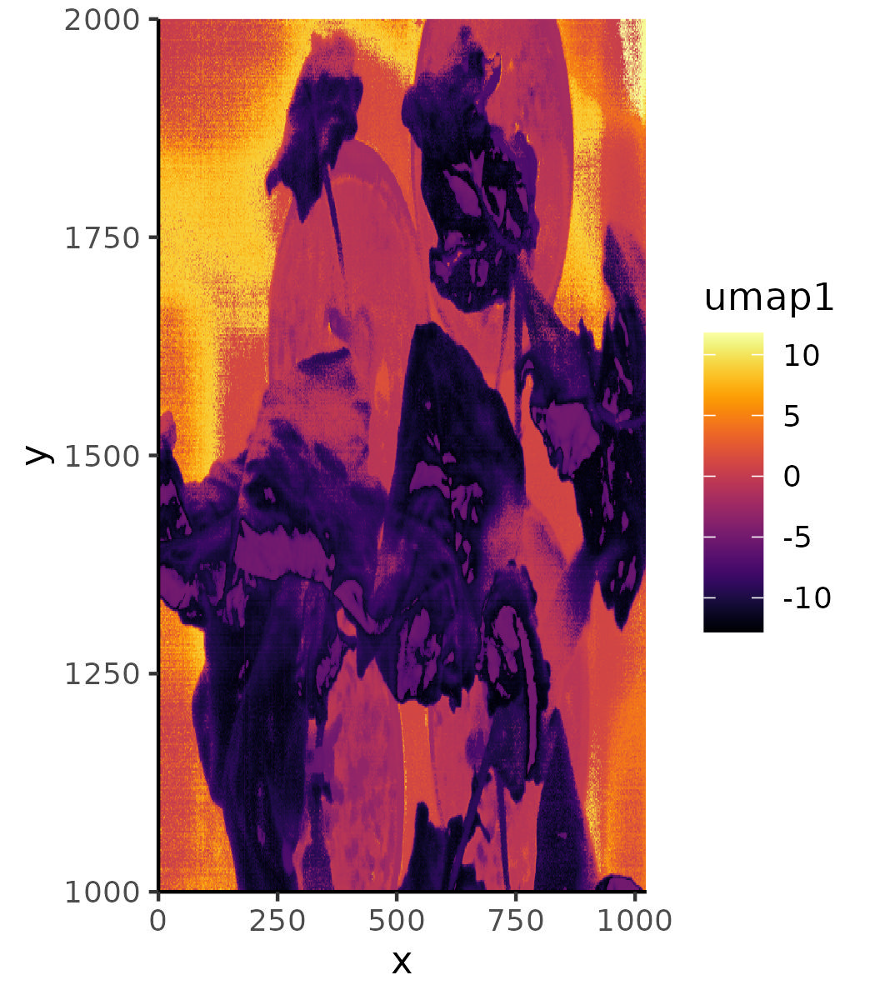
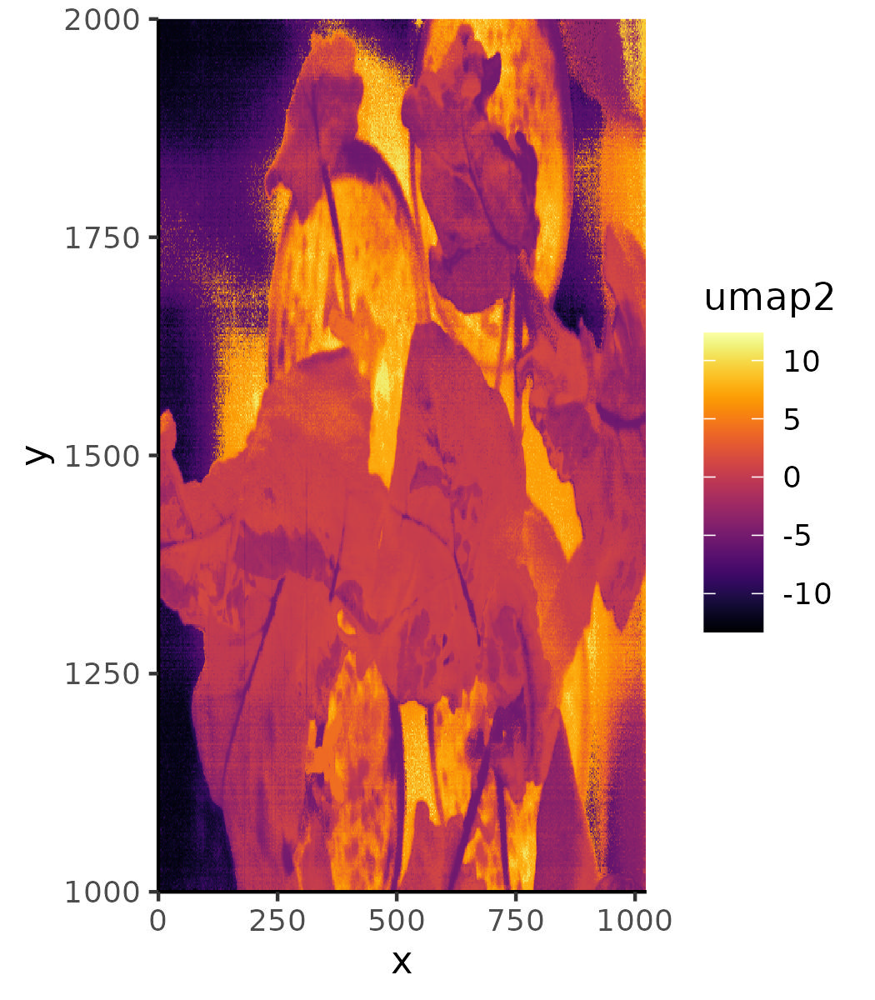
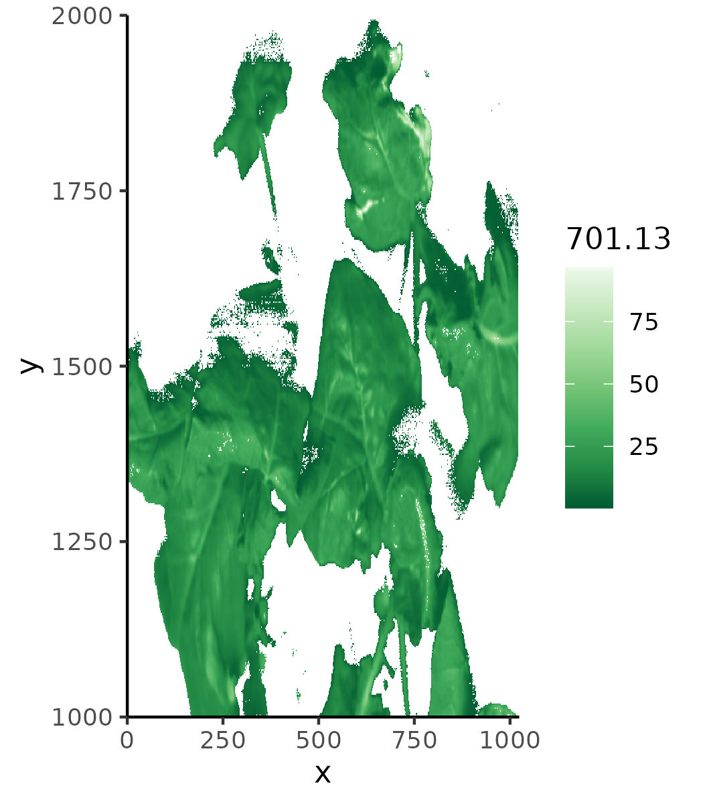
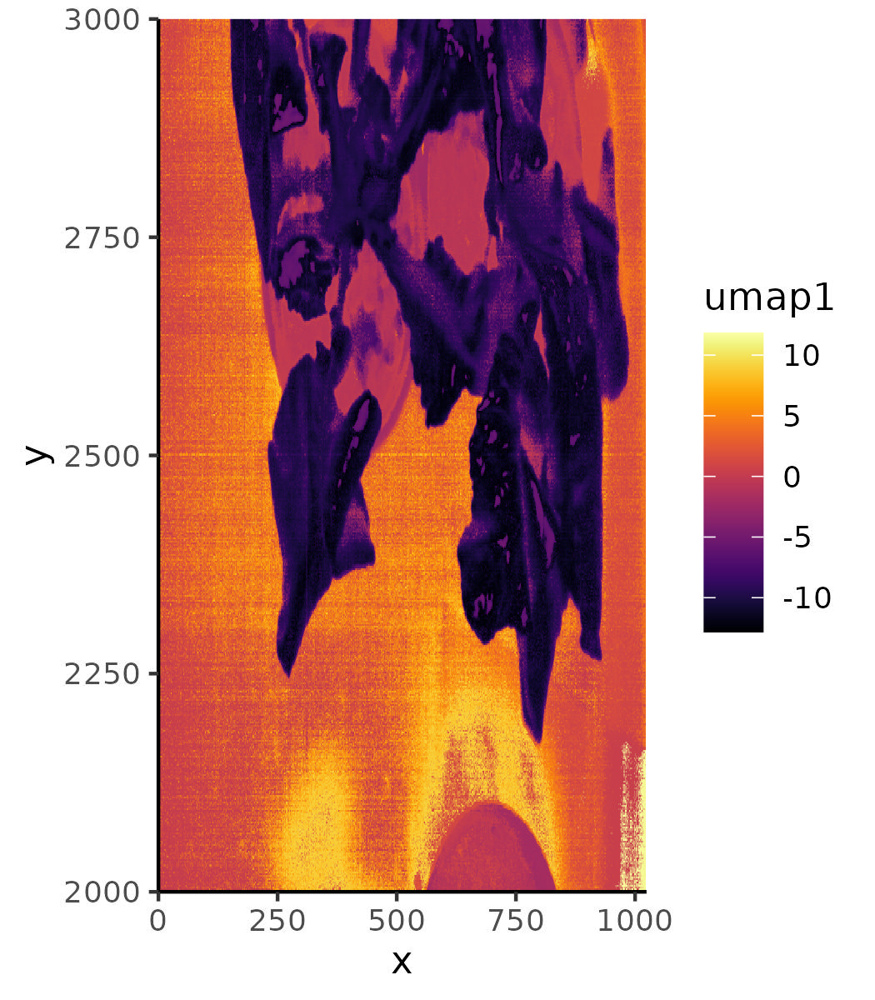
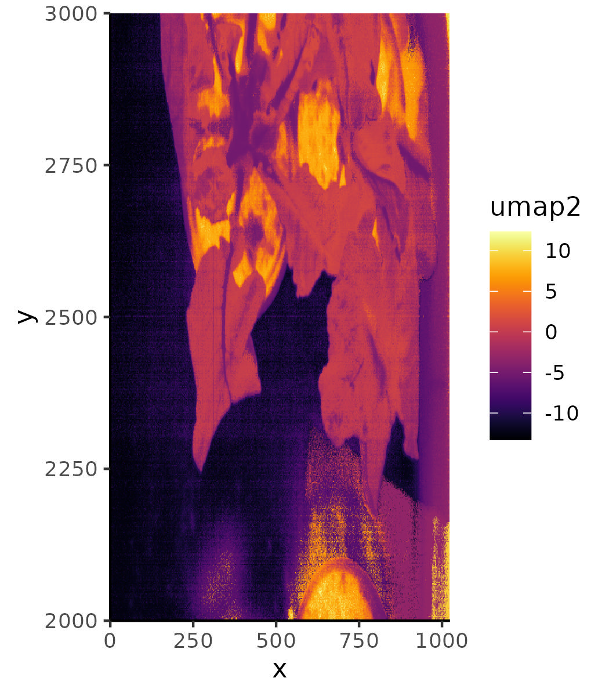
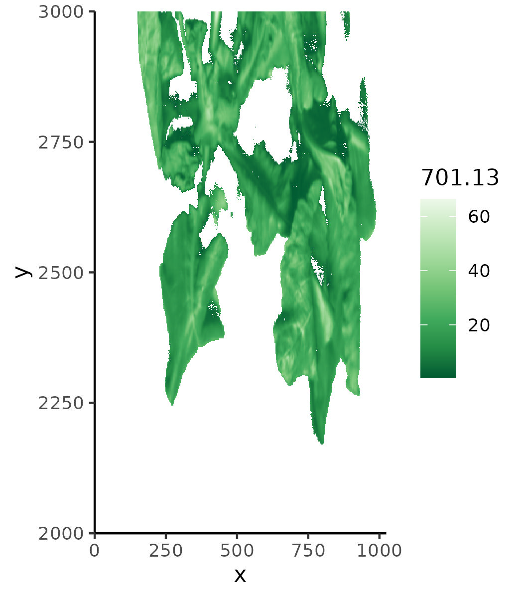

# hyU

## Introduction

hyU is an R package that provides an umap-based approach for image segmentation of hyperspectral imaging data. This package utilizes the UMAP (Uniform Manifold Approximation and Projection) algorithm to transform high-dimensional hyperspectral data into a lower-dimensional space, enabling efficient and effective segmentation of plant regions.


## Installation and Requirement

To use hyU, ensure that you have the following requirements:

1. R version >= 4.2.1
2. gcc/9.5.0
3. Additionally, you need to install the required R packages from CRAN. You can do this by running the following commands in R:

```R
install.packages("hyperSpec")
install.packages("uwot")
install.packages("data.table")
install.packages("tidyverse")
install.packages("scattermore")
install.packages("cowplot")
install.packages("RColorBrewer")
install.packages("viridis")
```

4. Make sure that R is included in your `PATH` environment variable to ensure smooth execution.


Feel free to explore hyU for hyperspectral image segmentation using the umap-based approach.


## Usage

### Step 1: Read ENVI file and write to plain TSV file

Use the `hyU_ENVItoTable.R` script to read the ENVI file and write the data to a plain TSV file. This step converts the hyperspectral image data into a tabular format that can be processed further. The script can be executed with the following command:

```shell
Rscript hyU_ENVItoTable.R <dat_file> <hdr_file> <output_file_name>
```

* `<dat_file>`: The body file of ENVI. It contains the actual data and is typically a large file.

* `<hdr_file>`: The header file of ENVI that provides metadata information.

* `<output_file_name>`: The name of the output file to be generated. It will be a plain text file in TSV (tab-separated values) format.

  - The first and second columns represent the x and y locations.

  - The remaining columns represent the reflectance values for each wavelength. Each column is named after the wavelength, and the corresponding values in each column represent the reflectance.

  - example

  - ```
    >str(df)
     $ x      : int  0 0 0 0 0 0 0 0 0 0 ...
     $ y      : int  0 1 2 3 4 5 6 7 8 9 ...
     $ 397.01 : num  81.5 81.5 77.9 88.6 63.7 ...
     $ 398.32 : num  73.5 95.9 95.9 95.9 84.7 ...
     $ 399.63 : num  73.6 91.9 113.9 88.3 120 ...
     $ 400.93 : num  87.8 101.7 112.2 77.4 120 ...
     $ 402.24 : num  98.9 102.5 95.3 106.1 120 ...
     $ 403.55 : num  96.4 93 99.7 103 119.5 ...
    
    ```

    

**An example of usage:**

```
Rscript hyU_ENVItoTable.R 20180816_1415_RT.raw 20180816_1415_RT.hdr TEST_1415RT.txt
```

In this example, the script `hyU_ENVItoTable.R` is used to read the ENVI file `20180816_1415_RT.raw` along with its corresponding header file `20180816_1415_RT.hdr`. The data is then written to the output file `TEST_1415RT.txt` in plain TSV format. The resulting file will contain the x and y locations in the first two columns, followed by the reflectance values for each wavelength.


### Step 2: Draw an image from the output plain TSV file

**Usage**

Use the `hyU_DrawRaw.R` script to draw an image from the output TSV file obtained in Step 1. This script visualizes a single wavelength for the image. Execute the script using the following command:

```shell
Rscript hyU_DrawRaw.R <tsv table from hyU_ENVItoTable.R> <output_file>
```

* `<tsv_table_from_hyU_ENVItoTable.R>`: The output TSV file obtained from Step 1 (`hyU_ENVItoTable.R`).
* `<output_file>`: The name of the image file to be generated. It should include the file extension. We encourage using `jpeg` as it provides smaller file sizes and is easier to open.
  - To speed up the process, only a single wavelength is used for visualization.
  - In the example, the wavelength used is `701.13`.
  - If you are familiar with `ggplot2`, you can modify the script to use a different wavelength.

**Example**

```shell
Rscript hyU_DrawRaw.R TEST_1415RT.txt TEST.1415RT.jpeg
```

In this example, the script `hyU_DrawRaw.R` is used to generate an image from the TSV file `TEST_1415RT.txt` obtained from Step 1. The resulting image file is named `TEST.1415RT.jpeg`. The image will represent the hyperspectral data for the specific wavelength `701.13`.

Output image should look like this:



### Step 3. Develop a model for UMAP

**Usage**

Use the `hyU_UmapModelTrain.R` script to develop a UMAP model using the TSV file generated in Step 1. This script performs the UMAP dimensionality reduction and generates visualizations of the UMAP projections. Execute the script using the following command:

```shell
hyU_UmapModelTrain.R <tsv table from hyspec_ENVItoTable.R> <output_prefix>
```

* `<tsv table from hyspec_ENVItoTable.R>`: The TSV file obtained from Step 1 

* `<output_prefix>`:This script will generate several files with the specified output prefix, including:

  * `uwot_model_from_<output_prefix>` :  UMAP model file.

  * `<output_prefix>_umap1.jpeg`:  Image representation based on UMAP 1 values. You should inspect this file to determine the threefold.

  * `<output_prefix>_umap2.jpeg`:  Image representation based on UMAP 2 values. You should inspect this file to determine the threefold.

  * `<output_prefix>_umap.txt`: A TSV file containing the x and y positions in the first and second columns, and the UMAP 1 and UMAP 2 values in the third and fourth columns.

    * For example

    * ```R
      > str(df_umap)
       $ x    : int  0 0 0 0 0 0 0 0 0 0 ...
       $ y    : int  1001 1002 1003 1004 1005 1006 1007 1008 1009 1010 ...
       $ umap1: num  0.8694 5.5157 0.0403 6.1871 0.1856 ...
       $ umap2: num  -12.54 -10.26 -11.83 -8.97 -11.69 ...
      ```

  * `<output_prefix>_PlantRegion.jpeg`: This image is generated by applying an arbitrary threshold to segment the plant region. It is drawn based on a single wavelength (`701.13`). You should inspect this image to ensure it includes the desired plant region.

  * `<output_prefix>_PlantRegion.txt`: This TSV file contains the segmentation result. The first and second columns represent the x and y positions, and the remaining columns represent the wavelengths and raw reflectance without any modification.


The default threshold is `y > 50 & umap1 < -5`. You can modify this threshold by changing the following section in `hyU_UmapModelTrain.R`:

```
print("# select plant region by umap, and save the raw reflectance data ===================")
Sys.time()
df_plant <- df_umap %>%
  filter(
    y > 50, ### <--- CHANGE HERE, THIS IS THE Y POSITION
    umap1 < -5 #### <--- CHANGE HERE, THIS IS THE THRESHOLD FOR umap1
  ) %>%
  select(
    x, y
  ) %>%
  left_join(
    x = .,
    y = df_part1,
    by = c("x", "y")
  )

```

Please adjust the threshold based on the information and characteristics of your specific data.


**Example**

```shell
Rscript hyU_UmapModelTrain.R TEST_1415RT.txt TEST.1415RT
```

The output image

* `TEST.1415RT_umap1.jpeg`



* `TEST.1415RT_umap2.jpeg`



* Based on the visualizations, it is clear and intuitive why the threshold `umap1 < -5` is used to segment the plant region. The resulting image representing the plant region is shown below:
* `TEST.1415RT_PlantRegion.jpeg`



### Step 4. Apply the UMAP model to the entire image to segment the plant region

**Usage**

Use the `hyU.PredictScanWholeImage.R` script to apply the UMAP model to the entire image and segment the plant region. This script divides the image into smaller parts based on the specified y-position range and performs UMAP prediction in each block. Execute the script using the following command:

```shell
Rscript hyU.PredictScanWholeImage.R <tsv table from hyU_ENVItoTable.R> <uwot model location> <output_prefix>
```

* `<tsv table from hyU_ENVItoTable.R>`: The output TSV file from Step 1, obtained from `hyU_ENVItoTable.R`.

* `<uwot model location>`: The location of the UMAP model file generated in Step 3, obtained from `hyU_UmapModelTrain.R`.
* `<output_prefix>`: This script will generate several files, including:
  * `<output_prefix>_PlantRegion_<START Y Position>_<END Y Position>_umap1.jpeg` : Image depicting the plant region based on UMAP1 values within the specified Y position range.
  * `<output_prefix>_PlantRegion_<START Y Position>_<END Y Position>_umap2.jpeg` :  Image depicting the plant region based on UMAP2 values within the specified Y position range.
  * `<output_prefix>_PlantRegion_<START Y Position>_<END Y Position>.jpeg` : Image representing the segmented plant region within the specified Y position range.
  * `<output_prefix>_PlantRegion_<START Y Position>_<END Y Position>.txt` : TSV file containing the segmented plant region within the specified Y position range. The first and second columns represent the x and y positions, and the rest of the columns contain the wavelength and raw reflectance values.

* To handle large ENVI files and balance RAM usage and speed, the image is segmented into different parts based on the y position. By default, it is divided into blocks of 1000 rows (e.g., 0-1000, 1000-2000, 2000-3000, and so on). You can modify this behavior in the following section:

* ```
  print("# run for loop =======================")
  RANGE_Y <- c(1000, 2000, 3000, 4000, 5000, 6000, 7000, 8000, 9000) ## <- START_Y POSITION !!!!!!!!
  
  lapply(RANGE_Y, FUN = function(NAM){
  
    START_Y <- as.numeric(NAM)
    END_Y <- as.numeric(NAM+1000) ### fix-window movement size !!!!!
  
  ```

* UMAP prediction is performed on each block. You can modify the threshold for segmenting the plant region in the following section:

* ```
    print("# select plant region by umap, and save the raw reflectance data ===================")
    print(Sys.time())
    df_plant <- df_umap %>%
      filter(
        y > 50, ## EXCLUDE Y POSITION !!!!!
        umap1 < -5 ## MODIFY UMAP1 THERSHOLD HERE !!!!!!!
      ) %>%
      select(
        x, y
      ) %>%
      left_join(
        x = .,
        y = df_part1,
        by = c("x", "y")
      )
  
  ```

* Make sure to adjust the parameters and thresholds according to your specific dataset and requirements.


**Example**

Here is some examples

| TEST.1415RT_PlantRegion_1000_2000_umap1.jpeg                 | TEST.1415RT_PlantRegion_1000_2000_umap2.jpeg                 | TEST.1415RT_PlantRegion_1000_2000.jpeg                       |
| ------------------------------------------------------------ | ------------------------------------------------------------ | ------------------------------------------------------------ |
|  |  |  |
| TEST.1415RT_PlantRegion_2000_3000_umap1.jpeg                 | TEST.1415RT_PlantRegion_2000_3000_umap2.jpeg                 | TEST.1415RT_PlantRegion_2000_3000.jpeg                       |
|  |  |  |
|                                                              |                                                              |                                                              |


## Conclusion

hyU provides a comprehensive workflow for hyperspectral image segmentation using UMAP-based approaches. By following the installation steps and utilizing the provided scripts, you can efficiently segment plant regions in hyperspectral images. Feel free to explore hyU and customize it further to suit your specific needs.
